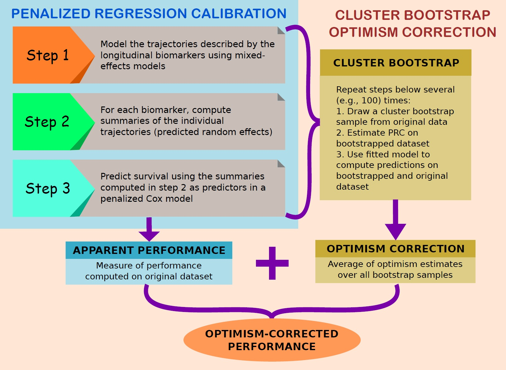

```{r, echo = F}
# CRAN limits number of available cores to 2 although it has 32
# in pencal this triggers warnings about the number of cores used
options(warn=-1)
# suppress warnings related to number of cores when rendering the vignette
```


# Introduction

## What is pencal?

`pencal` is an `R` package that has been created to make it easy and efficient to estimate and apply **Penalized Regression Calibration**.

## What is Penalized Regression Calibration?

Longitudinal and high-dimensional measurements have become increasingly common in biomedical research. However, methods to predict survival outcomes using covariates that are both longitudinal and high-dimensional are currently missing.

Penalized Regression Calibration (PRC) is a statistical method that has been developed to fill this methodological gap, making it possible to **predict survival using as predictors a set of covariates that are at the same time longitudinal and high-dimensional**.

PRC is described in detail in the following article:

Signorelli, M., Spitali, P., Al-Khalili Sgyziarto, C., The Mark-MD Consortium, Tsonaka, R. (in review). arXiv preprint: [arXiv:2101.04426](https://arxiv.org/abs/2101.04426).

## How does PRC work?

In short, PRC comprises three modelling steps:

1. in the first step, we **model the trajectories described by the longitudinal biomarkers using mixed effects models** (using either linear mixed models, or multivariate latent process mixed models);
2. in the second step, we **compute** the predicted random effects for the models estimated in step 1; in practice, the predicted random effects are **subject-specific summaries of the longitudinal trajectories**, which summarize the way in which the biomarkers change over time across subjects;
3. in the third step, we **estimate a penalized Cox model** where the summaries computed in step 3 are employed as covariates (alongside with other relevant covariates, such as baseline age or important confounders).

These steps allow to estimate PRC, and to obtain a model that can be used to compute predicted survival probabilities.

Additionally, one may want to quantify the predictive performance of the fitted model. To achieve this aim, in `pencal` we have implemented a **Cluster Bootstrap Optimism Correction Procedure** (CBOCP) that can be used to obtain optimism-corrected estimates of the C index and time-dependent AUC associated to the fitted model. Depending on the dimensionality of your dataset, computing the CBOCP might be time consuming; for this reason, we offer the possibility to parallelize the CBOCP using multiple cores.

Below you can see a graphical representation of the steps involved in the estimation of PRC (see the elements in the lightblue box) and in the computation of the CBOCP (elements in the salmon box).

<p align="center">
```{r, echo = F, out.width = "650px"}

```
</p>

## Get started

The `R` package `pencal` can be installed directly from CRAN using

```{r, eval=FALSE, echo=TRUE, results='asis'}
install.packages('pencal')
```

After installing `pencal`, you can load the package with

```{r, eval=TRUE, echo=TRUE, results='asis'}
library('pencal')
```

# Overview of the functionalities of pencal

## Model estimation and prediction

Estimation of the PRC-LMM model described in Signorelli et al. (in review) <!-- (arXiv link) --> can be performed using the following three functions:

1. `fit_lmms`, which implements the first step of the estimation of the PRC-LMM;
2. `summarize_lmms`, which carries out the second step;
3. `fit_prclmm`, which performs the third step.

These functions are run sequentially, with the output of `fit_lmms` used as input for `summarize_lmms`, and the output of `summarize_lmms` as input for `fit_prclmm`.

Lastly, the function `survpred_prclmm` computes survival probabilities based on the fitted PRC-LMM. 

## Cluster bootstrap optimism correction procedure

Most of the computations required by the CBOCP are performed by `fit_lmms`, `summarize_lmms` and `fit_prclmm`. Such computations may be time-consuming, and for this reason these functions make it possible to use parallel computing (this can be easily done with the argument `n.cores`). The last step of the CBOCP is performed by the function `performance_prclmm`, which returns the naive and optimism-corrected estimates of the C index and of the time-dependent AUC.

**Important note**: if you just want to estimate the PRC model, and you do not wish to compute the CBOCP, simply set `n.boots = 0` as argument of `fit_lmms`. If, instead, you do want to compute the CBOCP, set `n.boots` to the desired number of bootstrap samples (e.g., 100).

## Further functions

In addition to the functions mentioned above, `pencal` comprises also two functions that can be used to simulate example datasets:

* `simulate_t_weibull` to simulate survival data from a Weibull model;
* `simulate_prclmm_data` to simulate an example dataset for PRC-LMM which is comprehensive of a number of longitudinal biomarkers, a survival outcome and a censoring indicator.

# A step by step example

To illustrate how `pencal` works, let us simulate an example dataset that comprises $n = 100$ subjects, $p = 10$ longitudinal biomarkers that are measured at $t = 0, 0.2, 0.5, 1, 1.5, 2$ years from baseline, and a survival outcome that is associated with 5 (`p.relev`) of the 10 biomarkers:

```{r simulate, cache = T}
set.seed(1234)
p = 10
simdata = simulate_prclmm_data(n = 100, p = p, p.relev = 5, 
                               lambda = 0.2, nu = 1.5,
                               seed = 1234, t.values = c(0, 0.2, 0.5, 1, 1.5, 2))
ls(simdata)
```

Note that in this example we are setting $n > p$, but `pencal` can handle both low-dimensional ($n > p$) and high-dimensional ($n \leq p$) datasets.

## Input data

In order to estimate the PRC-LMM, you need to **provide the following two inputs**:

1. **a dataset in long format**, which should contain (at least) the following variables: a subject identifier that should be named `id`, the longitudinal biomarkers (here called `marker1`, ..., `marker10`), and the relevant time variables (in this example we will use `age` as covariate in the LMMs estimated in step 1, and `baseline.age` as covariate in the penalized Cox model estimated in step 3):

```{r view_longdata, fig.height=4, fig.width=5}
# view the dataset in long format
head(simdata$long.data)
# visualize the trajectories for a randomly picked biomarker
library(ptmixed)
ptmixed::make.spaghetti(x = age, y = marker5, 
               id = id, group = id,
               data = simdata$long.data, 
               margins = c(4, 4, 2, 2),
               legend.inset = - 1)
```

2. **a dataset with information on the survival outcome**, which should contain (at least) the following variables: a subject identifier that should be named `id`, the time to event outcome called `time`, and the binary event indicator called `event` (NB: make sure that the variable names associated to these three variables are indeed `id`, `time` and `event`!)

```{r view_survdata, fig.height=4.5, fig.width=4}
# view the dataset with the survival data
head(simdata$surv.data)
# what is the proportion of censoring in this dataset?
simdata$censoring.prop
# visualize an estimate of the survival function
library(survival)
library(survminer)
surv.obj = survival::Surv(time = simdata$surv.data$time, 
                event = simdata$surv.data$event)
kaplan = survival::survfit(surv.obj ~ 1,  
                  type="kaplan-meier")
survminer::ggsurvplot(kaplan, data = simdata$surv.data)
```

## Estimation of the PRC-LMM

Hereafter we show how to implement the three steps involved in the estimation of the PRC-LMM, alongside with the computation of the CBOCP.

## Some remarks on parallel computing with `pencal`

Before doing that, let's determine the number of cores that will be used for the computation of the CBOCP. In general you can use as many cores as available to you; to do this, you can set

```{r, eval=F}
n.cores = parallel::detectCores()
```

Since the [CRAN Repository Policy](https://cran.r-project.org/web/packages/policies.html) allow us to use at most 2 cores when building the vignettes, in this example we will limit the number of cores used to 2:

```{r}
n.cores = 2
```

Be aware, however, that **using more than 2 cores will speed computations up, and it is thus recommended**. Several functions in `pencal` will actually return a warning when you perform computations using less cores than available: the goal of such warnings is to remind you that you could use more cores to speed computations up; however, if you are purposedly using a smaller number of cores you can ignore the warning.

### Step 1

In the first step, for each biomarker we estimate a **linear mixed model** (LMM) where the longitudinal biomarker levels $y_{ij}$ depend on two fixed effects (one intercept, $\beta_0$ and one slope for age, $\beta_1$), on a subject-specific random intercept $u_{0i}$ and on a random slope for age $u_{1i}$:

$$y_{ij} = \beta_0 + u_{0i} + \beta_1 a_{ij} + u_{1i} a_{ij} + \varepsilon_{ij}.$$

To do this in `R` we use the `fit_lmms` function:

```{r step1, cache = T}
y.names = paste('marker', 1:p, sep = '')
step1 = fit_lmms(y.names = y.names, 
                 fixefs = ~ age, ranefs = ~ age | id, 
                 long.data = simdata$long.data, 
                 surv.data = simdata$surv.data,
                 t.from.base = t.from.base,
                 n.boots = 10, n.cores = n.cores)
```

Of course, the LMM fitted here is just an example of how to model longitudinal biomarker trajectories, and depending on the data you are dealing with you may choose to specify different fixed and random effects formulas.

Note that here I have set `n.boots = 10` to reduce computing time for the CBOCP, given that CRAN only allows me to use two cores.

In general, it is recommended to set `n.boots = 0` if you do not wish to compute the CBOCP, or to set `n.boots` equal to a larger number (e.g., 50, 100 or 200) if you want to accurately compute the CBOCP. In the latter case, consider using as many cores as available to you to speed the computations up.

`fit_lmms` returns as output a list with several elements; among them is `lmm.fits.orig`, which contains the LMMs fitted to each biomarker:

```{r}
ls(step1)
# estimated LMM for marker1:
step1$lmm.fits.orig[1]
```

For more details about the arguments of `fit_lmms` and its outputs, see the help page: `?fit_lmms`.

### Step 2

In the second step we **compute the predicted random intercepts and random slopes** for the LMMs fitted in step 1:

```{r step2, cache = T}
step2 = summarize_lmms(object = step1, n.cores = n.cores)
```

`summarize_lmms` returns as output a list that contains, among other elements, a matrix `ranef.orig` with the predicted random effects for the LMMs fitted in step 1:

```{r}
ls(step2)
# view predicted random effects for the first two markers
step2$ranef.orig[1:5, 1:4]
```

For more details about the arguments of `summarize_lmms` and its outputs, see the help page: `?summarize_lmms`.

### Step 3

Lastly, in the third step of PRC-LMM we estimate a **penalized Cox model** where we employ as predictors baseline age and all the summaries (predicted random effects) computed in step 2:

```{r step3, cache = T}
step3 = fit_prclmm(object = step2, surv.data = simdata$surv.data,
                   baseline.covs = ~ baseline.age,
                   penalty = 'ridge', n.cores = n.cores)
```

Note that here we have specified `penalty = 'ridge'`, but alternatively one may also use elasticnet or lasso as penalties. Moreover, by default the predicted random effects are standardized when included in the penalized Cox model (if you don't want to perform such standardization, set `standardize = F`).

`fit_prclmm` returns as output a list that contains, among other elements, the fitted penalized Cox model `pcox.orig`, which is a `glmnet` object:

```{r}
ls(step3)
class(step3$pcox.orig)
library(glmnet)
t(as.matrix(coef(step3$pcox.orig)))
```

For more details about the arguments of `fit_prclmm` and its outputs, see the help page: `?fit_prclmm`.

## Predicted survival probabilities

After fitting the model, you will probably want to obtain **predicted survival probabilities** for each individual at several time points. This can be done through the function `survpred_prclmm`, which takes as inputs the outputs of step 2 and step 3, alongside with the time points at which to compute the survival probabilities:

```{r}
preds = survpred_prclmm(step2, step3, times = c(1, 2, 3))
head(preds)
```

## Cluster bootstrap optimism correction and performance measures

To accurately quantify the predicted performance of the fitted PRC-LMM, we need to recur to some form of **internal validation** strategy (e.g., bootstrap, cross-validation, etc...).

In `pencal` the internal validation is performed through a Cluster Bootstrap Optimism Correction Procedure (CBOCP) that allows to compute **optimism-corrected estimates of the concordance (C) index and of the time-dependent AUC**.

Most of the steps that the CBOCP requires are directly computed by the functions `fit_lmms`, `summarize_lmms` and  `fit_prclmm` whenever the argument `n.boots` of `fit_lmms` is set equal to an integer > 0 (in other words: most of the computations needed for the CBOCP have already been performed in the code chunks executed above, so we are almost done!).

To gather the results of the CBOCP we can use the function `performance_prclmm`:

```{r cbocp, cache=T}
cbocp = performance_prclmm(step2, step3, times = c(1, 2, 3), 
                   n.cores = n.cores)
# C index estimates:
cbocp$concordance
# time-dependent AUC estimates:
cbocp$tdAUC
```

From the results above we can see that:

* the naive C index is estimated = 0.786, and the optimism-corrected C index is estimated = 0.747;
* the naive tdAUC for predictions at 1 year from baseline is estimated = 0.887, and the optimism-corrected estimate is = 0.850;
* the naive tdAUC for predictions at 2 years from baseline is estimated = 0.834, and the optimism-corrected estimate is = 0.796;
* the naive tdAUC for predictions at 3 years from baseline is estimated = 0.830, and the optimism-corrected estimate is = 0.770.

# Further details and material

The aim of this vignette is to provide a quick-start introduction to the `R` package `pencal`. Here I have focused my attention on the fundamental aspects that one needs to use the package. 

Further details, functions and examples can be found in [the manual of the package](https://CRAN.R-project.org/package=pencal/pencal.pdf).

The description of the method is available in an article [that you can read here](https://arxiv.org/abs/2101.04426).